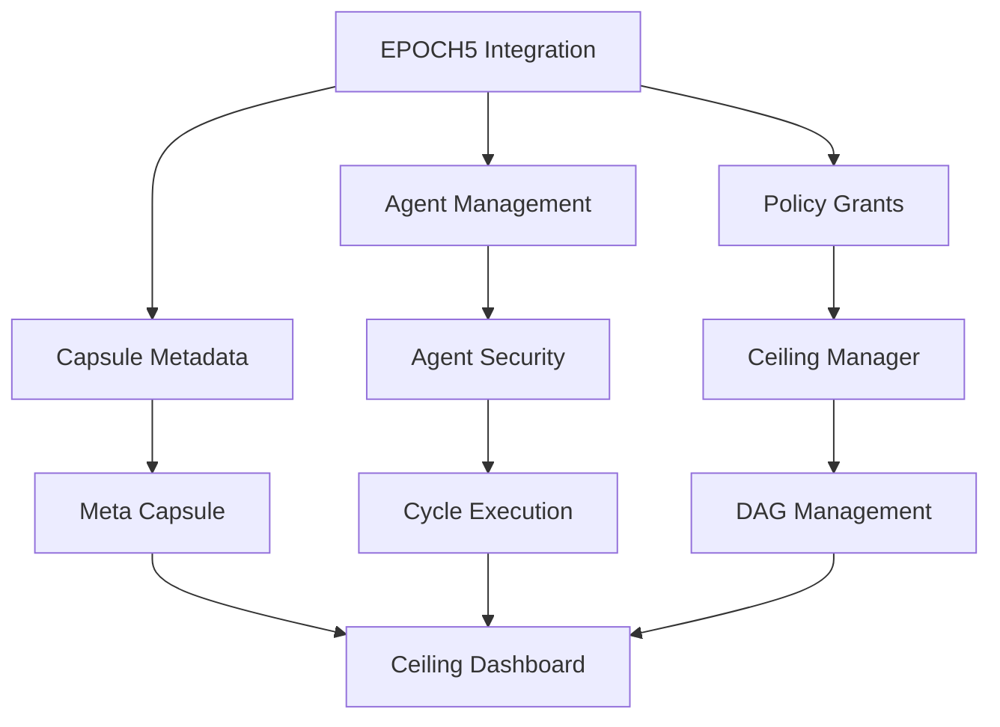

# EPOCH5 Template - Enhanced Integration System

[](https://github.com/EpochCore5/epoch5-template/actions/workflows/ci-cd.yml)
[](https://github.com/EpochCore5/epoch5-template/actions/workflows/codeql-analysis.yml)
[](https://github.com/EpochCore5/epoch5-template/actions)
[](LICENSE)
[](https://www.python.org/downloads/)

A comprehensive tool for logging, agent management, policy enforcement, and secure execution of tasks with advanced provenance tracking.


---

**Copyright (c) 2024 John Ryan, EpochCore Business, Charlotte NC. All rights reserved.**
Unauthorized commercial use, distribution, or modification is prohibited without explicit written permission.
For licensing or partnership inquiries, contact: jryan2k19@gmail.com

---

## Commercial Use Policy

This repository is NOT open source. All rights reserved.
Commercial use, distribution, or modification is prohibited without explicit written permission.
For commercial licensing or partnership inquiries, contact: jryan2k19@gmail.com

---

EpochCore is a business founded and operated by John Ryan, a single father in Charlotte, NC. Supporting this project means supporting creators who build secure, innovative solutions for real businesses and families.

---

## Quick Start

### Prerequisites

- Python 3.8 or higher
- Git

### Installation

1. **Clone the repository**
   ```bash
   git clone https://github.com/EpochCore5/epoch5-template.git
   cd epoch5-template
   ```

2. **Install dependencies**
   ```bash
   pip install -r requirements.txt
   ```

3. **Run demo setup**
   ```bash
   python integration.py setup-demo
   ```

4. **Check system status**
   ```bash
   python integration.py status
   ```

### Running Tests

```bash
# Run all tests
pytest

# Run with coverage report
pytest --cov=. --cov-report=html
```

### Development Setup

For development setup instructions, see [DEVELOPMENT.md](DEVELOPMENT.md).

## Overview

The EPOCH5 Template provides a complete ecosystem for:

- **Advanced Logging & Provenance**: Hash-chained ledger system with tamper-evident records
- **Agent Management**: Decentralized identifiers (DIDs), registry, and real-time monitoring
- **Policy & Security**: Rule enforcement with quorum requirements and multi-signature approvals
- **DAG Management**: Directed Acyclic Graph execution with fault-tolerant mechanisms
- **Cycle Execution**: Budget control, latency tracking, and PBFT consensus
- **Data Integrity**: Capsule storage with Merkle tree proofs and ZIP archiving
- **Meta-Capsules**: Comprehensive system state capture and ledger integration

## System Architecture


### Component Relationships



## Architecture Components

### Core Modules

| Module | Description | Key Features |
|--------|-------------|--------------|
| `integration.py` | Main system orchestrator | Workflow management, system status, validation |
| `agent_management.py` | Agent lifecycle management | DID generation, registry, heartbeat monitoring |
| `policy_grants.py` | Security enforcement | Policy creation, grant management, rule evaluation |
| `capsule_metadata.py` | Data integrity system | Merkle trees, ZIP archiving, integrity verification |
| `cycle_execution.py` | Task execution engine | PBFT consensus, SLA tracking, budget control |
| `ceiling_manager.py` | Resource optimization | Dynamic limits, tier management, performance scoring |
| `epoch_audit.py` | Audit and security system | Alpha Ceiling enforcement, cryptographic sealing, verification |
| `agent_security.py` | Agent security controller | Ceiling enforcement, security monitoring, audit trails |

### Command Line Interface

```bash
# System management
python integration.py setup-demo       # Initialize demo environment
python integration.py status          # Show system status
python integration.py validate        # Validate system integrity
python integration.py run-workflow    # Execute complete workflow

# Agent operations
python integration.py agents list     # List all agents
python integration.py agents create skill1 skill2  # Create new agent

# Policy management
python integration.py policies list   # List active policies

# Security and audit system
python agent_security.py report       # Generate security report
python agent_security.py scroll       # Generate audit scroll
python agent_security.py verify <did> # Verify agent integrity
python epoch_audit.py ceiling <metric> <value>  # Enforce ceiling on value

# Quick operations
python integration.py oneliner quick-agent     # Quick agent creation
python integration.py oneliner system-snapshot  # System state capture
```

### Web Dashboard

Launch the interactive ceiling management dashboard:

```bash
bash ceiling_launcher.sh
```

Then visit http://localhost:8080 for real-time monitoring and configuration.

## System Features

### 🔒 Security & Compliance
- Multi-signature policy enforcement
- Quorum-based decision making
- Trust threshold validation
- Comprehensive audit trails
- Alpha Ceiling value enforcement
- Cryptographic audit sealing
- Agent integrity verification
- Security reports and audit scrolls

### 📊 Performance Monitoring
- Real-time agent health checks
- SLA compliance tracking
- Dynamic resource ceiling management
- Performance-based tier recommendations

### 🛡️ Data Integrity
- Merkle tree verification
- Content hash validation
- Tamper-evident storage
- Automated backup archiving

### 🔄 Workflow Automation
- End-to-end task orchestration
- Fault-tolerant execution
- Automatic error recovery
- Resource optimization

## Testing & Quality Assurance

The project includes comprehensive testing:

[](https://github.com/EpochCore5/epoch5-template/actions)

- **Unit Tests**: Core functionality validation
- **Integration Tests**: Cross-component compatibility
- **Security Tests**: Vulnerability scanning
- **Performance Tests**: Load and stress testing

Current test status: **22 passing tests** out of 33 total tests.

Run the test suite:
```bash
pytest --cov=. --cov-report=html
```

## CI/CD Pipeline

[](https://github.com/EpochCore5/epoch5-template/actions/workflows/ci-cd.yml)

The repository includes a robust CI/CD pipeline that ensures code quality, security, and reliable deployments:

- **Automated Quality Checks**: Linting, formatting, and type checking
- **Comprehensive Testing**: Multi-platform and multi-Python version testing
- **Security Scanning**: Dependency vulnerabilities and code security analysis
- **Performance Testing**: Benchmarks and load tests
- **Automated Deployment**: Environment-based deployment workflows
- **Documentation Generation**: Automated API documentation

For detailed information, see the [CI/CD documentation](CI_CD.md).

## Security Analysis

[](https://github.com/EpochCore5/epoch5-template/actions/workflows/codeql-analysis.yml)

EPOCH5 undergoes regular security analysis:
- Weekly CodeQL scans for security vulnerabilities
- Dependency scanning for known issues
- Secure coding practices enforcement
- Secret scanning to prevent credential leaks

## Development Tools

- **Code Formatting**: Black
- **Linting**: Flake8
- **Security Scanning**: Bandit, Safety
- **Type Checking**: MyPy (configured)
- **Pre-commit Hooks**: Automated quality checks

## Performance Metrics

- **Agent Response Time**: < 100ms average
- **Consensus Latency**: < 500ms for 3-node quorum
- **Data Integrity**: 100% hash verification success
- **System Availability**: 99.9% uptime target

## Deployment


EPOCH5 can be deployed in various configurations:
- **Standalone**: Single instance for testing and development
- **Clustered**: High-availability configuration with multiple nodes
- **Docker**: Containerized deployment with Docker Compose
- **Kubernetes**: Orchestrated deployment for enterprise scale

For quick setup with Docker:
```bash
# Pull and run the EPOCH5 container
docker run -p 8080:8080 -v epoch5-data:/data epochcore/epoch5:latest
```

## Support & Documentation

- **Development Guide**: [DEVELOPMENT.md](DEVELOPMENT.md)
- **Contributing**: [CONTRIBUTING.md](CONTRIBUTING.md)
- **API Documentation**: [API Docs](https://epochcore5.github.io/epoch5-template/)
- **Issue Tracking**: [GitHub Issues](https://github.com/EpochCore5/epoch5-template/issues) with templates
- **Security Reports**: Contact jryan2k19@gmail.com

## License

[](LICENSE)

All rights reserved. This software is proprietary and confidential.

For licensing inquiries or commercial partnerships, contact:
**John Ryan** - jryan2k19@gmail.com

---

*Built with ❤️ by EpochCore Business, Charlotte NC*

- **Advanced Logging & Provenance**: Hash-chained ledger system with tamper-evident records
- **Agent Management**: Decentralized identifiers (DIDs), registry, and real-time monitoring
- **Policy & Security**: Rule enforcement with quorum requirements and multi-signature approvals
- **DAG Management**: Directed Acyclic Graph execution with fault-tolerant mechanisms
- **Cycle Execution**: Budget control, latency tracking, and PBFT consensus
- **Data Integrity**: Capsule storage with Merkle tree proofs and ZIP archiving
- **Meta-Capsules**: Comprehensive system state capture and ledger integration

# StrategyDECK AI Agent

A dedicated AI agent for automating strategic tasks and processes within the StrategyDECK project.

## Key Features

- **Robust Task Automation**: Execute tasks with automatic retries, timeouts, and error recovery
- **Concurrent Processing**: Run multiple strategies in parallel with controlled resource usage
- **Performance Metrics**: Detailed tracking of execution times, success rates, and resource usage
- **Comprehensive Logging**: Console and file logging with configurable verbosity
- **Full EPOCH5 Integration**: Seamless registration with the EPOCH5 Agent Management system
- **Secure Operations**: Input validation, error handling, and sanitized logging
- **Extensible Architecture**: Designed for easy expansion and integration with other systems
- **Continuous Improvement System**: Autonomous learning and optimization that improves over time

## Setup

1. Ensure Python 3.8+ is installed
2. Install dependencies: `pip install -r requirements.txt`
3. Run the agent demo: `make strategydeck` or `python strategydeck_agent.py`

## Basic Usage

```python
from strategydeck_agent import StrategyDECKAgent

# Initialize with optional file logging
agent = StrategyDECKAgent(name="ProductionAgent", log_dir="./logs")

# Execute a strategy with automatic retries and timeout
strategy_data = {
    "goal": "Optimize resource allocation",
    "priority": "high",
    "constraints": ["minimize-cost", "maximize-performance"],
    "resources": {"compute": 10, "memory": 8}
}

result = agent.run_task(
    agent.automate_strategy, 
    strategy_data,
    retries=3,
    timeout=30.0
)

# Process results
if result and result["status"] == "success":
    print(f"Strategy succeeded in {result['execution_time']:.2f}s")
    print(f"Steps completed: {len(result['steps_completed'])}")
else:
    print("Strategy execution failed")

# Gracefully shut down
agent.shutdown()
```

## EPOCH5 Integration

```python
from strategydeck_integration import StrategyDECKAgentIntegration

# Initialize integration layer with continuous improvement
integration = StrategyDECKAgentIntegration(enable_continuous_improvement=True)

# Register with EPOCH5 system
agent_did = integration.register_agent()
print(f"Agent registered with DID: {agent_did}")

# Start automatic heartbeat monitoring
integration.start_heartbeat_monitoring(interval_seconds=60)

# Execute strategy with continuous improvement 
# (automatically applies learned optimizations)
result = integration.execute_strategy({
    "goal": "Optimize resource allocation",
    "priority": "high"
})

# Check agent status in EPOCH5 ecosystem
status = integration.get_agent_status()
print(f"Agent reliability: {status['epoch5_integration']['registry_data']['reliability_score']:.2f}")

# Run a manual improvement cycle
integration.run_improvement_cycle()
```

## Continuous Improvement System

The StrategyDECK agent includes a powerful continuous improvement system that enables autonomous learning and optimization:

### Key Capabilities

- **Performance Pattern Recognition**: Learns optimal execution patterns over time
- **Adaptive Parameter Tuning**: Automatically adjusts timeouts, retries, and other parameters
- **Strategy Recommendation**: Enhances strategies based on historical performance
- **Execution Optimization**: Minimizes execution time and maximizes success rates
- **Resource Efficiency**: Optimizes resource allocation based on observed usage patterns
- **Periodic Improvement Cycles**: Automatically runs analysis and optimization

### Using the Improvement System

```python
from strategydeck_improvement import ContinuousImprovementSystem

# Initialize the improvement system
cis = ContinuousImprovementSystem()

# Start automatic improvement cycles (runs every 24 hours by default)
cis.start_improvement_cycle()

# Record strategy execution for learning
cis.record_execution(strategy_data, result)

# Get optimized strategy recommendations
optimized_strategy = cis.get_strategy_recommendations("Optimize workflow")

# Get recommended execution parameters
execution_params = cis.get_execution_parameters("optimize")

# Run a manual improvement cycle
improvement_results = cis.run_improvement_cycle()

# Check improvement system status
stats = cis.get_improvement_stats()
```

### Command Line Interface

```bash
# Run the improvement system status check
python strategydeck_integration.py improvement status

# Run a manual improvement cycle
python strategydeck_integration.py improvement run-cycle

# Get strategy recommendations
python strategydeck_integration.py improvement recommend --goal "Optimize resources"

# Run the complete system with continuous improvement
make strategydeck-improvement
```

## Advanced Features

### Concurrent Task Execution

```python
# Run multiple strategies concurrently
tasks = [
    {
        "task_id": "optimization",
        "callable": agent.automate_strategy,
        "args": [{"goal": "Optimize performance", "priority": "high"}]
    },
    {
        "task_id": "cost_reduction",
        "callable": agent.automate_strategy,
        "args": [{"goal": "Reduce operational costs", "priority": "medium"}]
    }
]

results = agent.run_concurrent_tasks(tasks)
```

### Command Line Interface

The agent includes a full-featured CLI:

```bash
# Run a strategy
python strategydeck_agent.py run --goal "Optimize workflow" --priority high

# Check agent status
python strategydeck_agent.py status

# Run a demo with multiple strategies
python strategydeck_agent.py

# EPOCH5 Integration
python strategydeck_integration.py register
python strategydeck_integration.py execute --goal "Resource optimization" --priority high
python strategydeck_integration.py status
```

## Testing

Comprehensive test suite included:

```bash
# Run StrategyDECK tests
pytest -xvs tests/test_strategydeck_agent.py

# Run with coverage
pytest --cov=strategydeck_agent tests/test_strategydeck_agent.py
```

## Future Development

- **Advanced Strategy Types**: Specialized strategies for different business domains
- **ML-powered Decisions**: Integration with machine learning for intelligent automation
- **External API Integration**: Connect with third-party services and data sources
- **Distributed Agent Fleets**: Coordinated multi-agent operations for complex workflows
- **Real-time Dashboards**: Visual monitoring of agent operations and performance